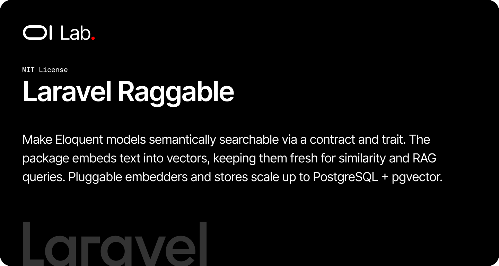

# OI Laravel Raggable

[](https://packagist.org/packages/oi-lab/oi-laravel-raggable)
[](https://packagist.org/packages/oi-lab/oi-laravel-raggable)
[](https://github.com/oi-lab/oi-laravel-raggable/actions)
[](LICENSE)

Make **any** Eloquent model semantically searchable. Add a contract and a trait to a model, describe the text that represents it, and the package embeds that content into vectors, keeps them fresh as the model changes, and answers similarity and RAG-retrieval queries. The embedder and the vector store are both pluggable, so you can start on any database with zero infrastructure and graduate to PostgreSQL + pgvector at scale without touching your models.

## Features

- **Plug any model** — implement `Embeddable` and `use HasEmbedding`; nothing else changes about your model.
- **Automatic, incremental indexing** — saving a model re-embeds it on a queue only when its embeddable attributes actually changed (content-hash skip).
- **Pluggable embedder** — a Laravel AI-backed default (`mistral-embed`, OpenAI, Voyage, …) or any provider you implement via the `Embedder` contract.
- **Pluggable vector store** — a portable `database` driver (JSON storage + in-PHP cosine, works on SQLite/MySQL/Postgres) or a `pgvector` driver (native `vector` columns + HNSW indexes) for scale.
- **Chunking built in** — long content is split into overlapping chunks so a single record never exceeds the provider token limit and each vector stays focused.
- **Similarity & RAG queries** — `similarTo()` for related content, `similarToText()` as the retrieval entry point of a RAG pipeline.
- **Polymorphic storage** — one `raggable_embeddings` / `raggable_chunks` pair serves every embeddable model; no per-model migration.
- **Typed everywhere** — `spatie/laravel-data` DTOs, a static resolver for every configurable class, and a `raggable:embed` backfill command.

## How It Works

Two polymorphic tables back every embeddable model:

- **`raggable_embeddings`** — one row per model instance (the *document header*): the source text, a content hash, the provider/model used, and a document-level centroid vector.
- **`raggable_chunks`** — the searchable slices. Long text is chunked; each chunk carries its own vector. Similarity search runs at the chunk level for precision, then collapses back to the parent models.

When an `Embeddable` model is saved, `HasEmbedding` dispatches a `GenerateEmbeddingJob` (only if the embeddable attributes changed). The job runs the `EmbeddingService`, which chunks the text, calls the configured `Embedder`, and persists the header + chunks. Queries go through the `SimilarityService`, which turns a source model or a free-text query into a vector and hands it to the configured `VectorStore`.

## Requirements

- PHP 8.2+
- Laravel 11, 12, or 13
- `laravel/ai` (default embedder) — or your own `Embedder` implementation
- `spatie/laravel-data` ^4.23
- For the `pgvector` driver: PostgreSQL with the `vector` extension available (optionally `pgvector/pgvector`)

## Installation

```bash
composer require oi-lab/oi-laravel-raggable
```

### Publish & Migrate

```bash
php artisan vendor:publish --tag=oi-laravel-raggable-config
php artisan migrate
```

> **Set the vector dimensions before migrating.** `oi-laravel-raggable.dimensions` must equal your embedding model's output size (e.g. `mistral-embed` = 1024, `text-embedding-3-small` = 1536). The `pgvector` migration reads it to size the column.

## Configuration

Key options in `config/oi-laravel-raggable.php`:

```php
// Storage driver: 'database' (portable, any DB) or 'pgvector' (Postgres, at scale).
'driver' => env('RAGGABLE_DRIVER', 'database'),

// MUST equal the embedding model output size. Set before migrating.
'dimensions' => (int) env('RAGGABLE_DIMENSIONS', 1024),

// Re-embed automatically when embeddable attributes change.
'auto_refresh' => (bool) env('RAGGABLE_AUTO_REFRESH', true),

// Queue the generation job runs on.
'queue' => env('RAGGABLE_QUEUE', 'default'),

// The embedder — swap for any Embedder implementation.
'embedder' => \OiLab\OiLaravelRaggable\Embedders\LaravelAiEmbedder::class,

'similarity' => [
    'max_distance' => (float) env('RAGGABLE_MAX_DISTANCE', 0.5), // cosine distance cutoff
    'limit' => (int) env('RAGGABLE_LIMIT', 20),
],

// Registry used by `raggable:embed`.
'embeddables' => [
    // 'documents' => \App\Models\Document::class,
],
```

## Usage

### Make a model embeddable

```php
use Illuminate\Database\Eloquent\Model;
use OiLab\OiLaravelRaggable\Concerns\HasEmbedding;
use OiLab\OiLaravelRaggable\Contracts\Embeddable;

class Document extends Model implements Embeddable
{
    use HasEmbedding;

    // The text that represents this model. embeddingTextFrom() strips HTML and
    // normalizes whitespace, dropping empty fragments.
    public function toEmbeddingText(): string
    {
        return $this->embeddingTextFrom([$this->title, $this->summary, $this->body]);
    }

    // Only a change to these attributes triggers a re-embed. Keep it tight.
    public function embeddableAttributes(): array
    {
        return ['title', 'summary', 'body'];
    }
}
```

That's it. From now on, every `save()` that changes `title`, `summary`, or `body` refreshes the vector in the background; unchanged content is free.

### Find similar models

```php
// Related content from an existing record (same type by default).
$related = $document->similar(limit: 5);

// Each result carries the cosine distance (0 = identical).
$related->first()->similarity_distance;
```

### Search from free text (RAG retrieval)

```php
use OiLab\OiLaravelRaggable\Services\SimilarityService;

$hits = app(SimilarityService::class)
    ->similarToText('How do I reset my password?', Document::class, limit: 8);
```

### Backfill an existing corpus

Register the models, then run the command:

```php
// config/oi-laravel-raggable.php
'embeddables' => [
    'documents' => \App\Models\Document::class,
],
```

```bash
php artisan raggable:embed --sync          # inline (dev)
php artisan raggable:embed                 # queued — needs a worker on the configured queue
php artisan raggable:embed documents --fresh
```

## Extending

### Plug your own embedder

Implement the `Embedder` contract and point config at it:

```php
use OiLab\OiLaravelRaggable\Contracts\Embedder;
use OiLab\OiLaravelRaggable\Data\EmbeddingResult;

class MyEmbedder implements Embedder
{
    public function embed(array $texts): EmbeddingResult
    {
        // return one vector per input, in order
        return new EmbeddingResult(vectors: $vectors, provider: 'mine', model: 'my-model');
    }
}
```

```php
'embedder' => \App\Ai\MyEmbedder::class,
```

### Switch to pgvector at scale

Set `RAGGABLE_DRIVER=pgvector` (and the correct `dimensions`) on a PostgreSQL connection, then migrate. The migration enables the extension, creates native `vector` columns and HNSW cosine indexes, and the `PgvectorStore` runs nearest-neighbor search in the database. Changing dimensions later means recreating the columns/indexes and re-running `raggable:embed --fresh`.

## Database Schema

- **`raggable_embeddings`** — `embeddable_type` / `embeddable_id` (polymorphic, unique), `content_hash`, `content`, `vector`, `provider`, `model`, `generated_at`.
- **`raggable_chunks`** — `uuid` id, `embedding_id`, `content`, `vector`, `metadata`, `chunk_index`, `token_count`.

Both models are configurable through `oi-laravel-raggable.models.*` so you can subclass them in the host app.

## AI Assistant Skills

This package ships an AI assistant skill so AI coding assistants know how to use it. Install it into your project:

```bash
php artisan oi:skills oilab-laravel-raggable --project
```

## Testing

```bash
composer test
```

## Contributing

Contributions are welcome! Please feel free to submit a Pull Request.

When contributing:
1. Write tests for new features
2. Ensure all tests pass: `vendor/bin/pest`
3. Follow existing code style
4. Update documentation as needed

## License

The MIT License (MIT). Please see the [License File](LICENSE) for more information.

## Credits

**[Olivier Lacombe](https://www.olacombe.com)** - Creator and maintainer

Olivier is a Product & Technology Director based in Montpellier, France, with
over 20 years of experience innovating in UX/UI and emerging technologies. He
specializes in guiding enterprises toward cutting-edge digital solutions,
combining user-centered design with continuous optimization and artificial
intelligence integration.

**Projects & Resources:**
- [OI Dev Docs](https://dev.olacombe.com) - Documentation for all Open Source OI Lab packages
- [OnAI](https://onai.olacombe.com) - Training courses and masterclasses on generative AI for businesses
- [Promptr](https://promptr.olacombe.com) - Prompt engineering Management Platform

## Support

For support, please open an issue on the [GitHub repository](https://github.com/oi-lab/oi-laravel-raggable/issues).
